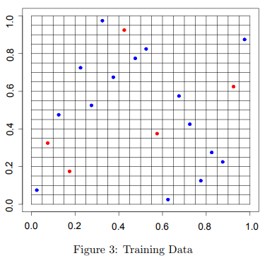

### Chapter 8 - Exercise 7

```{r}
library(MASS)
library(randomForest)
set.seed(1)

train <- sample(1:nrow(Boston), nrow(Boston) / 2)
Boston.train <- Boston[train, -14]
Boston.test <- Boston[-train, -14]
Y.train <- Boston[train, 14]
Y.test <- Boston[-train, 14]
rf.boston1 <- randomForest(Boston.train, y = Y.train, xtest = Boston.test, ytest = Y.test, mtry = ncol(Boston) - 1, ntree = 500)
rf.boston2 <- randomForest(Boston.train, y = Y.train, xtest = Boston.test, ytest = Y.test, mtry = (ncol(Boston) - 1) / 2, ntree = 500)
rf.boston3 <- randomForest(Boston.train, y = Y.train, xtest = Boston.test, ytest = Y.test, mtry = sqrt(ncol(Boston) - 1), ntree = 500)

plot(1:500, rf.boston1$test$mse, col = "green", type = "l", xlab = "Number of Trees", ylab = "Test MSE", ylim = c(10, 19))
lines(1:500, rf.boston2$test$mse, col = "red", type = "l")
lines(1:500, rf.boston3$test$mse, col = "blue", type = "l")
legend("topright", c("m = p", "m = p/2", "m = sqrt(p)"), col = c("green", "red", "blue"), cex = 1, lty = 1)
```

Clearly, the test MSE is high when we only use a single tree, but decreases as the number of trees increases. It begins to plateau once we reach about 80 trees or so. Additionally, the test MSE for all predictors is higher than the test MSE when we use half the predictors, which is higher than when we use the square root of the number of predictors.

### Chapter 8 - Exercise 8

a) 
```{r}
library(ISLR)
set.seed(1)
train <- sample(1:nrow(Carseats), nrow(Carseats) / 2)
Carseats.train <- Carseats[train, ]
Carseats.test <- Carseats[-train, ]
```

b)
```{r}
library(tree)
tree.carseats <- tree(Sales ~ ., data = Carseats.train)
summary(tree.carseats)

plot(tree.carseats)
text(tree.carseats, pretty = 0)

yhat <- predict(tree.carseats, newdata = Carseats.test)
mean((yhat - Carseats.test$Sales)^2)
```

The tree is relatively complex. We first split at ShelveLoc, then Price, and then that's where the similarities stop in the trees. The next predictors are usually age and then CompPrice, but sometimes additional splits on price are used after the initial price split, so I fear the tree may be prone to high variance. Additionally, as seen from above, the test MSE is 4.148897, which is about 4.15.

c)
```{r}
cv.carseats <- cv.tree(tree.carseats)
plot(cv.carseats$size, cv.carseats$dev, type = "b")
tree.min <- which.min(cv.carseats$dev)
points(tree.min, cv.carseats$dev[tree.min], col = "red", cex = 2, pch = 20)

prune.carseats <- prune.tree(tree.carseats, best = 8)
plot(prune.carseats)
text(prune.carseats, pretty = 0)

yhat <- predict(prune.carseats, newdata = Carseats.test)
mean((yhat - Carseats.test$Sales)^2)
```

With CV, we find a tree size of 8 to perform the best. So, we use this to prune the tree and obtain a tree with 8 nodes. After pruning, the test MSE becomes 5.09085 (about 5.1), which means the MSE has increased. However, the interpretability of the tree has significantly increased and it looks a lot cleaner, thus improving statistical inference significantly with just a slight increase in test MSE. I belive this tree will generalize better than the previous one.

d)
```{r}
library(randomForest)

bag.carseats <- randomForest(Sales ~ ., data = Carseats.train, mtry = 10, ntree = 500, importance = TRUE)
yhat.bag <- predict(bag.carseats, newdata = Carseats.test)
mean((yhat.bag - Carseats.test$Sales)^2)

importance(bag.carseats)
```

We obtain a test MSE of 2.6, which is basically half of the previous test MSE. This is a good sign. Additionally, we found Price and ShelveLoc to be the most important predictors sinc ethey have the best node purity and %IncMSE by far compared to the other predictors.

e)
```{r}
rf.carseats <- randomForest(Sales ~ ., data = Carseats.train, mtry = 3, ntree = 500, importance = TRUE)
yhat.rf <- predict(rf.carseats, newdata = Carseats.test)
mean((yhat.rf - Carseats.test$Sales)^2)

importance(rf.carseats)
```

We find a test MSE of 3.3 when $m = \sqrt{p}$. With the importance function, we once again find Price and ShelveLoc to be the most important predictors by the same metrics, but less strongly compared to the part d).

### Chapter 8 - Exercise 10

a)
```{r}
Hitters <- na.omit(Hitters)
Hitters$Salary <- log(Hitters$Salary)
```

b)
```{r}
train <- 1:200
Hitters.train <- Hitters[train, ]
Hitters.test <- Hitters[-train, ]
```

c)
```{r}
library(gbm)
set.seed(1)
pows <- seq(-10, -0.2, by = 0.1)
lambdas <- 10^pows
train.err <- rep(NA, length(lambdas))
for (i in 1:length(lambdas)) {
    boost.hitters <- gbm(Salary ~ ., data = Hitters.train, distribution = "gaussian", n.trees = 1000, shrinkage = lambdas[i])
    pred.train <- predict(boost.hitters, Hitters.train, n.trees = 1000)
    train.err[i] <- mean((pred.train - Hitters.train$Salary)^2)
}
plot(lambdas, train.err, type = "b", xlab = "Shrinkage values", ylab = "Training MSE")
```

The minimum training MSE is found with a shrinkage value of about 0.62 and MSE of nearly 0.0.

d)
```{r}
set.seed(1)
test.err <- rep(NA, length(lambdas))
for (i in 1:length(lambdas)) {
    boost.hitters <- gbm(Salary ~ ., data = Hitters.train, distribution = "gaussian", n.trees = 1000, shrinkage = lambdas[i])
    yhat <- predict(boost.hitters, Hitters.test, n.trees = 1000)
    test.err[i] <- mean((yhat - Hitters.test$Salary)^2)
}
plot(lambdas, test.err, type = "b", xlab = "Shrinkage values", ylab = "Test MSE")

min(test.err)
lambdas[which.min(test.err)]
```

The minimum test MSE is 0.25, which is located with a shrinkage value of 0.079.

e)
```{r}
library(glmnet)

fit1 <- lm(Salary ~ ., data = Hitters.train)
pred1 <- predict(fit1, Hitters.test)
mean((pred1 - Hitters.test$Salary)^2)

x <- model.matrix(Salary ~ ., data = Hitters.train)
x.test <- model.matrix(Salary ~ ., data = Hitters.test)
y <- Hitters.train$Salary
fit2 <- glmnet(x, y, alpha = 0)
pred2 <- predict(fit2, s = 0.01, newx = x.test)
mean((pred2 - Hitters.test$Salary)^2)
```

The test MSE for boosting is lower than both linear and ridge regression.

f)
```{r}
library(gbm)

boost.hitters <- gbm(Salary ~ ., data = Hitters.train, distribution = "gaussian", n.trees = 1000, shrinkage = lambdas[which.min(test.err)])
summary(boost.hitters)
```

We can clearly see CAtBat is definitely the most important variable by far, followed in a distant second by CRBI.

g)
```{r}
set.seed(1)
bag.hitters <- randomForest(Salary ~ ., data = Hitters.train, mtry = 19, ntree = 500)
yhat.bag <- predict(bag.hitters, newdata = Hitters.test)
mean((yhat.bag - Hitters.test$Salary)^2)
```

The bagging test MSE is 0.23, which is a little bit lower than the boosting test MSE.

### Exercise 4

a) Let's assume for a moment there's a decision tree with several terminal nodes with decision values. Now, with a new sample, let's just say it fits into terminal node $T$. Also, assume there are only two output classes in our dataset (0 and 1). If the terminal node has 11 samples in it, with 5 0s and 6 1s, a majority vote classification tree will output 1 as the prediction for that new sample at that specific node $T$. However, this does not account for the near equal class balance in this node. With regression, we can take the average value (in this case, it is 6/11 = 0.55). This provides a bit more statistical inference than the typical classification tree. In this sense, we are about 55% confident this new sample should have class 1 and 45% confidence it should be class 0. As such, a regression tree is valuable for even providing this extra bit of statistical inference.

b) 
```{r}
dat <- data.frame(replicate(10, sample(0:1, 1000, rep = TRUE)))
class0 <- runif(500, 0, 0.1)
class1 <- runif(500, 0.51, 0.65)

y <- append(class0, class1)
yRound <- round(y)
dat$y <- y

plot(1:1000, y)

accs = 0
for(i in 1:10){
  train <- sample(1:nrow(dat), 900)
  trainX <- dat[train, -11]
  trainY <- dat[train, 11]
  testX <- dat[-train, -11]
  testY <- dat[-train, 11]
  yRoundTest <- yRound[-train]
  
  # regression tree classification
  rfRand <- randomForest(trainX, y = trainY, xtest = testX, ytest = testY, mtry = ncol(dat) - 1, ntree = 500, importance = TRUE)
  
  regClassif <- round(rfRand$test$predicted)
  conf <- table(regClassif, yRoundTest)
  acc <- sum(diag(conf))/sum(conf)
  
  accs <- accs + acc
}
accs <- accs/10

dat$y <- yRound

accs2 <- 0
for(i in 1:10){
  train <- sample(1:nrow(dat), 900)
  trainX <- dat[train, -11]
  trainY <- dat[train, 11]
  testX <- dat[-train, -11]
  testY <- dat[-train, 11]
  
  regClassif
  
  # normal classification tree
  rfRand <- randomForest(trainX, y = trainY, xtest = testX, ytest = testY, mtry = ncol(dat) - 1, ntree = 500, importance = TRUE)
  conf <- table(rfRand$test$predicted, yRoundTest)
  conf
  acc2 <- sum(diag(conf))/sum(conf)
  
  accs2 <- accs2 + acc2
}
accs2 <- accs2/10

accs
accs2
```

From a higher-level perspective, the answer is actually quite obvious. For example, let's assume a dataset contains probabilities of a user visiting a website from search engine links based on previous search results. Each sample possesses a probability of the user visiting the desired website (e.g. my website). For a given node, assume it contains 10 observations with the following probabilities:

$$0.0, 0.04, 0.05, 0.08, 0.52, 0.53, 0.58, 0.64, 0.65, 0.65$$

In this sense, probability > 0.5 indicates the user will click on my website. A probability < 0.5 indicates the user will not click on my website. So, it is a binary classification task. With majority vote classification, at this node, we see 6 of the samples indicate the user will click on our website. However, all of these probabilities are relatively low (they're not very confident since they're far from probability 1.0). With regression, we see average voting produces probability 0.374. Not only does this produce a different classification than the typical classification tree, but the results are $\textbf{significantly}$ closer to class 0 than class 1. In a practical setting, the ground truth value for this sample would be class 0 (the user will not visit my website), so the classification tree was incorrect and the regression tree was correct. The regression tree is more preferable since it adds some statistical inference (a ``confidence" of our prediction), but it also takes into account how close each sample is to each class, which is not something you would do with a classification tree.

Now, examine the above code. I generated a dataset of 1000 samples, 500 of which are class 0 (with probability between 0.00 and 0.10), and the other 500 being in class 1 (with probability between 0.51 and 0.65). We random sample and partition the datasets for 10-fold cross-validation. The first trees generated are regression random forests, which output the average probabilities of the terminal node. These output probabilities are rounded to their nearest integer (indicating the predicted class), resulting in a 50.6% accuracy. On the other hand, the second task utilized majority vote classification random forests and achieved an accuracy of 1.2%. We can easily notice a huge disarprity in accuracy in the two approaches, which is a result of my above explanation for this occurrence. Please keep in mind the question in general asked for a regression/classification tree, but I instead used random forests with mtry = 10 (number of predictors), so it essentially boiled down to being a boosting of decision trees anyway. Lastly, one could argue since this is a binary classification task, we can take the poor classifier, flip the predictions, and get a 98.8% accuracy. While true, this is a special case pertaining $\textit{only}$ to the binary task, and really is not the focus of this task/explanation. That reasoning will disappear for any task that's more complex (3-way, 4-way, etc.), so the point is moot and anybody arguing for that point is missing the larger picture.

As such, we have explained and displayed how regression trees performing classification can in fact end up with better classification rates than regular classification trees.

### Exercise 5

a)
```{r}
library(randomForest)

df.train <- read.table("HW7train.csv", sep=",", header=T)

train <- sample(1:nrow(df.train), 900)
trainX <- df.train[train, -1]
trainY <- df.train[train, 1]
testX <- df.train[-train, -1]
testY <- df.train[-train, 1]
```

b)
```{r}
rf <- randomForest(trainX, y = trainY, xtest = testX, ytest = testY, mtry = ncol(df.train) - 1, ntree = 500, importance = TRUE)

importance(rf)

par(mfrow=c(3,1))
plot(rf$importance[,1],type="b",axes=F,ann=F,ylim=c(0,max(rf$importance[,1])+1))
axis(1,at=1:10,lab=names(df.train)[-1])
axis(2,at=seq(0,max(rf$importance)+1,0.25),las=1)
box()
```

Yes, there are two predictors, X1 and X2, that seem significantly more important than the other predictors due to their node purity value.

c)
```{r}
mse.perm <- c()

for(i in 1:10){
  trainSamp <- sample(1:900, 900)
  newTrainX <- as.data.frame(trainX)
  newTrainX[, i] <- trainX[trainSamp, i]
  
  rfNew <- randomForest(newTrainX, y = trainY, xtest = testX, ytest = testY, mtry = ncol(df.train) - 1, ntree = 500, importance = TRUE)
  
  mse <- mean((rfNew$test$predicted - testY)^2)
  mse.perm <- c(mse.perm, mse)
}

plot(mse.perm,type="b",axes=F,ann=F,ylim=c(0,max(mse.perm)+1))
axis(1,at=1:10,lab=names(df.train)[-1])
axis(2,at=seq(0,max(mse.perm)+1,0.25),las=1)
box()
```

These predictors no longer look most important. They look like they have the same importance as the other predictors.

d)
```{r}
mse.loo <- c()

for(i in 1:10){
  newTrainX <- trainX[, -i]
  newTestX <- testX[, -i]
  
  rfNew <- randomForest(newTrainX, y = trainY, xtest = newTestX, ytest = testY, mtry = ncol(df.train) - 2, ntree = 500, importance = TRUE)
  
  mse <- mean((rfNew$test$predicted - testY)^2)
  mse.loo <- c(mse.loo, mse)
}

plot(mse.perm,type="b",axes=F,ann=F,ylim=c(0,max(mse.perm)+1))
axis(1,at=1:10,lab=names(df.train)[-1])
axis(2,at=seq(0,max(mse.perm)+1,0.25),las=1)
box()
```

They look like the MSEs in part (c). I would trust the results from (b) and (c) more than the results from (a) since we have validated the lack of importance in these predictors on multiple occasions. When comparing (b) and (c), I trust (c) more since if a predictor is removed from the model, and it has significant predictive power (it is important to the model), then the MSE should increase much more compared to other predictors. However, if a predictor being removed doesn not modify the model power at all, then I assume we do not need the predictor as much anyway. In part (b), we still had the data in the model, so the random forest model could still technically make splits (albeit crappy ones) on the already existing data.

e)
```{r}
summary(df.train)

for(i in 1:11){
  plot(df.train[, i], df.train$y)
}

cor(df.train[, 2:11], df.train$y)
```

When a summary is done on the data, we see no noticeable differences. In fact, all predictors have roughly the same range, mean, median, and upper/lower bounds. However, when we graph each predictor against the response, we can see predictors X1 and X2 both have stronger linear relationships than the other predictors with more homoscedasticity, or lower variance along the possible regression line. Additionally, when we analyze the correlations, we notice X1 and X2 have correlations at 0.53 and 0.54, which are significantly higher than the other predictors, which hover around 0.2 and 0.3. This reflects the recently mentioned "stronger" linear relationships between X1 and X2 with the response. This explains why these predictors are seen as a bit more important than the other predictors.

### Exercise 7

a) There isn't much to their ``pure noise" model as this question suggests. It isn't really that fancy. They use a probability distribution $P(y = 1 | \textbf{x}) = p = 0.75$ to generate some training dataset, where $y \in \{-1, +1\}$. In this sense, we let y = 1 be labelled as normal, justified, expected training data points and y = -1 be viewed as noise. In this sense, with 20 samples, 75% of them are expected to be normal samples and the remaining 25% are expected to be noise. The problem they're trying to solve is generating a classifier with the ability to be robust to noise while also correctly classifying examples.

For example, they compare logistic regression with local methods, such as AdaBoost, kNN, and random forests. Logistic regression will generally create a decision boundary between two classes. So, there is little to no room to create local disparities in the model to encapsulate noisy data. Their picture with the linear regression model explains this pretty well. Instead of fitting a typical linear regression model to all 10 data points (9 normal and 1 outlier), they instead fit the model to all 9 normal points with a small, local spike for the outlier. In this sense, the linear regression model is converted to a local method. K-nearest neighbors, random forests, and AdaBoost are clear examples of models that can abuse this locality characteristic. This can be seen in Figure 1 below.


The reason they call it a $\textbf{pure}$ noise model specifically is because the data points have no real structure (they refer to `structure' as `signal'), much to a linear relationship you might observe in a linear regression problem. As such, a sample of either class (-1 or +1) can be generated at any location in the two-dimensional map they created in Figure 3 below. In this sense, since the locations of the samples can be generated anywhere in the dataset, it looks like random noise to humans if the datapoints were not labelled. The goal is to analyze these models (AdaBoost, kNN, and random forests) to view their locality methods capable of generalizing well to the correct training data and also the occasional noisy samples.



b) After rewriting the model, it still models off of a probability distribution, but it looks a bit different: $P(y = 1 | \textbf{x}) = p = 0.90$. In this sense, the data is exactly the same (as requested in this question), but the labels of the data are shifted a bit for a few samples. As such, the data looks less noisy and there seems to be a clear pattern as you might notice in the below two pictures:


In this sense, we do not need to overfit a new model to the blue dots since there is a general trend in how the blue data is placed on the map. It's honestly pretty obvious and doesn't require that much explanation.

c) The authors define an interpolating classifier as a classifier that for every training set example, the classifier outputs the correct class label ($f(X_i) = Y_i$). Let's use linear regression to contrast with the other methods discussed by the authors and in this part (c) question. Linear regression fits to the overall data, but doesn't really pay much attention to individual samples. As such, an outlier above the regression line might increase the intercept of the line, but won't actually change the physical shape, so the overall fit to the data will just generally be slightly worse. There isn't much chance for a regression model to overfit to the training data. On the other hand, a polynomial regression model has a higher chance of doing so, but that's besides the scope of this question. Now, contrast this with a random forest model. A random forest model memorizes the training data because each terminal node, in the case of a regression tree, will output the mean value of the training samples at that terminal node. So, we have remaining artifacts from the resposne values of the training data. As such, boosting and random forests can become so granular and fit so well to the training dataset (by either making splits at specific intervals of a feature to ensure the best error rate), that they have this `interpolation' factor seen in Figure 1 from part (a). K-nearest neighbors has a somewhat similar feature. Basically, when a noisy point exists, the model doesn't have to fit to the entire training dataset (i.e. linear regression), but can have these sort of `local' models or, localization techniques, to ensure the model fits to the noise, but can also make it so the noise doesn't severaly impact the fit to the non-noise data points.

d) It doesn't generalize to real data because those `noisy' points are generally outliers. For example, if our dataset consisted of samples where a patient was diagnosed with a % of having cancer, and then that was compared to whether they actually had cancer, one outlier might be a patient with a really low diagnosed % of having cancer, but then they had cancer. So, in our dataset, the model would interpolate and fit to that outlier, classifying similar samples as non-cancer patients. As such, these interpolation problems work for this toy dataset and problem, but in reality, is very often not what the data scientist wants the results to look like. 

In terms of the justification for why the methods work across different datasets, the reasoning is pretty straightforward. A random forests model will always find granular splits in the data to ensure local methods for any kind of feature. As such, no matter the dataset, the splits will always be there and the local configurations/splits will be calculated for features to maintain node purity, regardless of the size or type of dataset. This same general methodology can be abstracted to a kNN or AdaBoost model.